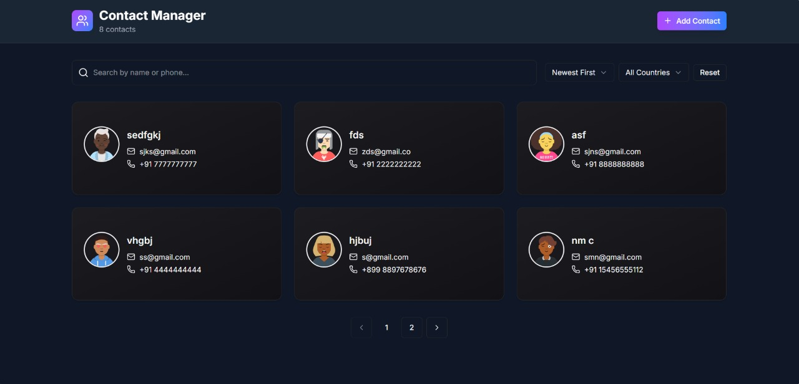
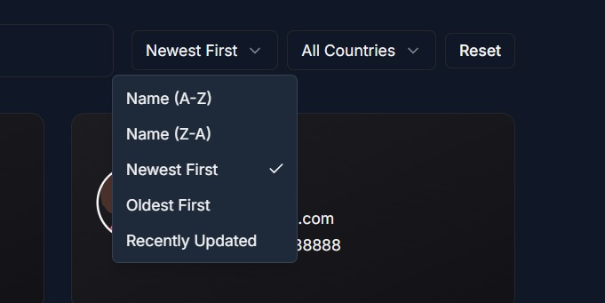

# Contact Manager

A modern, full-stack contact management application built with the Next.js App Router, React 19, and MongoDB. The application provides a clean, animated, and responsive interface for managing user contacts, complete with search, sorting, and filtering.


## Key Features

This project demonstrates a complete full-stack CRUD (Create, Read, Update, Delete) workflow with a rich user interface.

* **Full CRUD Functionality:** Create, read, update, and delete contacts.
* **Animated UI:** Smooth page loads and component animations powered by **Framer Motion**.
* **Powerful Data Fetching:** Client-side data management using **TanStack React Query**, with automatic caching, invalidation, and request deduplication.
* **Dynamic Filtering & Sorting:**
    * Search by name or phone number (with debouncing).
    * Sort by name (A-Z, Z-A) or date (newest, oldest, recently updated).
    * Filter by country code.
* **Robust Form Validation:** Client-side form validation using **Zod** and **React Hook Form** for reliable user input.
* **API Backend:** A complete RESTful API built with Next.js API Routes.
* **Modern UI:** Built with **Tailwind CSS** and **shadcn/ui** components.
* **Notifications:** Clean, simple toast notifications for all actions (create, update, delete) using **Sonner**.
* **Responsive & Dark Mode Ready:** Fully responsive design that works on all screen sizes, with a default dark mode theme.
* **Loading & Empty States:** Skeletons for loading and clear "no results" messages for empty states.

### Screenshots

**Main UI (Example):**



**Contact Details:**


**Add Contact Form:**


**Sort Functionality:**



**Delete Modal:**


## Tech Stack

### Frontend
* **Framework:** Next.js 16 (App Router)
* **Language:** TypeScript
* **UI Library:** React 19
* **Styling:** Tailwind CSS & shadcn/ui
* **State Management:** TanStack React Query (`@tanstack/react-query`)
* **Animations:** Framer Motion
* **Forms:** React Hook Form
* **Schema Validation:** Zod
* **HTTP Client:** Axios
* **Utilities:** `date-fns`, `use-debounce`, `lucide-react`

### Backend
* **Runtime:** Next.js API Routes
* **Database ODM:** Mongoose
* **Avatar Generation:** `@dicebear/core`

### Database
* **Database:** MongoDB

---

## Getting Started

Follow these instructions to get the project running locally.

### 1. Prerequisites

Make sure you have the following installed:
* Node.js (v18 or later)
* npm, yarn, or pnpm
* A MongoDB database (local or cloud-hosted, e.g., MongoDB Atlas)

### 2. Installation

1.  **Clone the repository:**
    ```bash
    git clone [https://github.com/Shubhraj-Shubh/TRIA.git](https://github.com/Shubhraj-Shubh/TRIA.git)
    cd your-repo-name
    ```

2.  **Install dependencies:**
    ```bash
    npm install
    ```

3.  **Set up environment variables:**
    Create a file named `.env.local` in the root of the project and add your MongoDB connection string. This is required by `lib/db.ts`.

    ```
    MONGODB_URI="your_mongodb_connection_string_here"
    ```

4.  **Run the development server:**
    ```bash
    npm run dev
    ```

The application will be available at [http://localhost:3000](http://localhost:3000).

---

## API Endpoints

The backend is handled by Next.js API Routes located in `app/api/`.

| Method | Endpoint | Description |
| :--- | :--- | :--- |
| `POST` | `/api/contacts` | Creates a new contact. |
| `GET` | `/api/contacts` | Retrieves all contacts. Supports pagination (`page`, `limit`), sorting (`sort`), search (`search`), and filtering (`country`). |
| `GET` | `/api/contacts/[id]` | Retrieves a single contact by its ID. |
| `PUT` | `/api/contacts/[id]` | Updates an existing contact by its ID. |
| `DELETE` | `/api/contacts/[id]` | Deletes a contact by its ID. |

---

## Project Structure Overview

Here is a high-level overview of the project's folder structure:

```
├── app/
│   ├── api/                # Backend API routes (CRUD)
│   │   └── contacts/
│   ├── layout.tsx          # Root layout (with providers)
│   └── page.tsx            # Main application page
│
├── components/
│   ├── ui/                 # shadcn/ui components
│   ├── ContactCard.tsx     # Component for displaying a single contact
│   ├── ContactForm.tsx     # Form for adding/editing contacts (with Zod)
│   ├── ContactManager.tsx  # Main component (fetches data, manages state)
│   ├── ContactModal.tsx    # Modal for viewing, editing, or adding
│   ├── DeleteAlert.tsx     # Deletion confirmation dialog
│   ├── FilterControls.tsx  # Sort and filter dropdowns
│   ├── PaginationControls.tsx
│   ├── SearchBar.tsx
│   └── providers.tsx       # Wraps app in React Query, ThemeProvider, etc.
│
├── lib/
│   ├── db.ts               # MongoDB connection logic
│   ├── schema.ts           # Zod schemas for form validation
│   └── utils.ts            # Utility functions (cn, avatar generation)
│
├── models/
│   └── Contact.ts          # Mongoose schema for the 'Contact' model
│
└── types/
    └── contact.ts          # TypeScript interface for the Contact object
```
